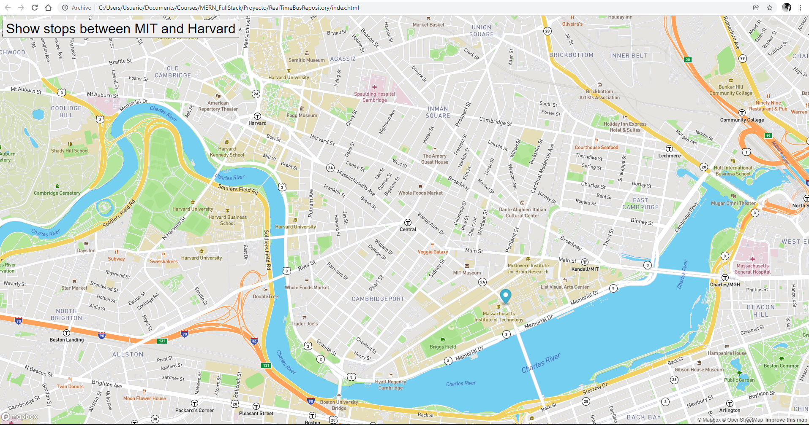

# Map Animation
## Description

Proyecto mostrando la funcionalidad que pueden proveer servicios particulares para un fin específico, por ejemplo aqui con mapbox podemos usarlo para manejar información en un mapa.

## How to run

La ejecucion es abriendo el archivo index.html en cualquier browser, si deseas ver con consola te recomiendo Google Chrome; 
presionando el botón "Show stops between MIT and Harvard" veras una animación de diferentes puntos en el mapa.

## Improvements

Agregarle un header, ver si es posible crear una línea con las paradas.

## Exercise on eyes

